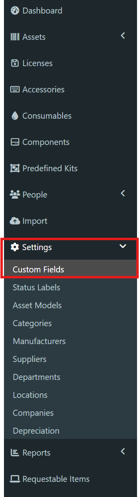
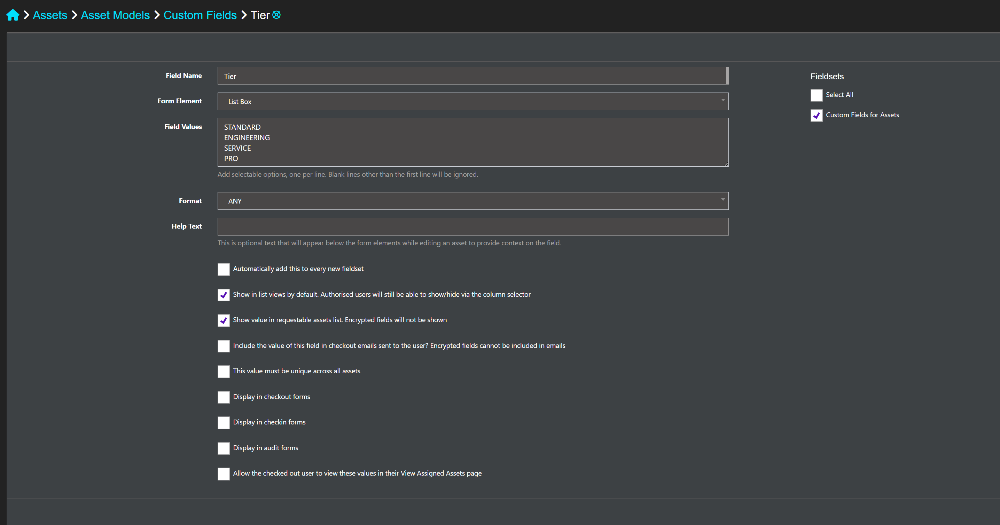
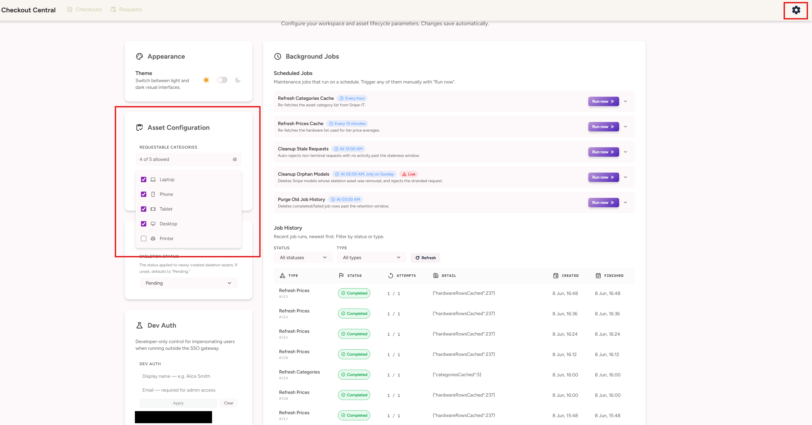
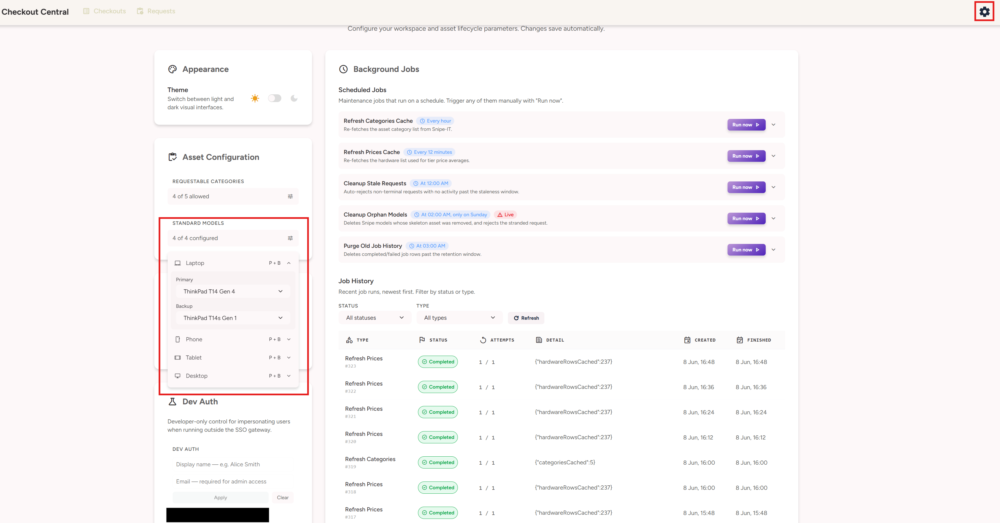
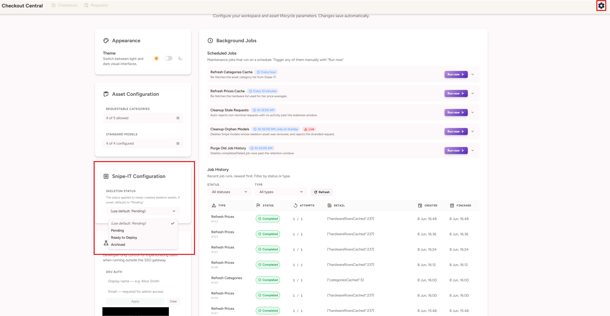

# AssetCheckout — Documentation

In-depth reference for how AssetCheckout works, how to configure it, and how its
data is structured. For getting it running locally, see the root
[README](../README.md); for production deployment, see [DEPLOYMENT](DEPLOYMENT.md).

## Contents

- [How it works](#how-it-works)
- [Authentication](#authentication)
- [Snipe-IT bot setup](#snipe-it-bot-setup)
- [The Tier custom field](#the-tier-custom-field)
- [Application settings](#application-settings)
- [Common configuration issues](#common-configuration-issues)
- [Background jobs](#background-jobs)
- [Database](#database)

---

## How it works

### The request lifecycle

A request moves through a small state machine. Standard and non-standard
requests share the same outer states but diverge in how they're fulfilled.

**Outer states (the `Request`):**

- **PENDING** — a user has submitted a request; it's awaiting a manager's
  decision.
- **APPROVED** — a manager (or admin) has approved it. For standard requests
  this is usually transient (the asset is assigned immediately and the request
  goes straight to COMPLETED). For non-standard requests, APPROVED means the
  request now has work to do before it can complete.
- **COMPLETED** — an asset has been checked out to the user. Terminal.
- **REJECTED** — the request was declined (by a person, or automatically by the
  stale-request cleanup job). Carries a reason. Terminal.

**Standard requests** are for hardware you stock and have pre-configured as a
"standard model" for its category. On approval, the app finds an available asset
of the configured primary model (or the backup, or — if neither is configured —
any model in the category with availability), checks it out to the user, and the
request completes in a single step.

**Non-standard requests** are for hardware that has to be sourced or modelled
specifically. They go through additional sub-steps tracked on a child
`ModelRequest` record:

1. **Manager approval** creates the `ModelRequest` (status PENDING) alongside
   the approved request.
2. **Admin approval** advances the `ModelRequest` to APPROVED.
3. **Model creation** — the admin either links an existing Snipe-IT model or
   creates a new one. Creating a new one also creates a barebones "skeleton"
   asset in Snipe-IT. The `ModelRequest` reaches COMPLETED and is linked to that
   asset.
4. **Asset details** — the admin fills in the asset's company, location, status,
   serial, tier, and price (saved progressively; partial saves are allowed).
   When all required fields are present, the asset is marked ready.
5. **Complete** — the now-complete asset is checked out to the user and the
   request reaches COMPLETED.

If a non-standard request is rejected at any point before completion, any
skeleton asset already created in Snipe-IT is intentionally left in place rather
than auto-deleted (it may still be useful). Cleaning that up is handled
separately — see the orphaned-model cleanup job in [Background jobs](#background-jobs).

---

## Authentication

AssetCheckout does not implement login, sessions, or an identity provider of its
own. Its entire authentication contract is one assumption:

> Every request that reaches the backend has already been authenticated by an
> upstream reverse proxy, which injects the signed-in user's identity as the
> `X-User-Email` and `X-User-Name` headers.

You place an authenticating proxy in front of the app. The proxy validates the
user's session against whatever SSO/identity provider you run and, on success,
forwards the request to AssetCheckout with the user's email and name injected as
those two headers. Any proxy/SSO combination that can do this works; see
[DEPLOYMENT](DEPLOYMENT.md) for the recommended forward-auth setup with Caddy.

> **The proxy must strip any client-supplied `X-User-*` headers before injecting
> its own.** Otherwise a user can forge them and impersonate anyone, including an
> admin. This is the single most important detail of the auth model.

From those headers the backend derives identity and role:

- **Admin** — the `X-User-Email` matches an entry in the `ADMIN_EMAILS`
  environment variable. Keyed on email so it survives display-name changes.
- **Manager** — the `X-User-Name` appears as the `manager` on at least one
  existing request.
- **Requester** — the `X-User-Name` appears as the `userName` on at least one
  existing request.
- Otherwise, no access (the user is shown a "no access" page).

Note that role resolution happens *after* authentication: a user with no role
is an authenticated person who simply has no access to this tool, not someone
who failed to log in — login is the proxy's responsibility, upstream of the app.

### Development authentication

Standing up a full SSO proxy just to develop locally would be painful, so in
development the app provides an impersonation shortcut:

- When `NODE_ENV=development`, a **DevAuthToggle** in the settings page lets you
  set `x-dev-user-name` / `x-dev-user-email` headers (stored in `localStorage`),
  impersonating any user so you can exercise the different roles without real SSO.
- The frontend toggle is gated on the build mode and is not rendered in a
  production build.
- **The backend refuses to honour the `x-dev-user-*` headers unless
  `NODE_ENV === "development"`.** Outside development those headers are ignored
  entirely and only the proxy-injected `X-User-*` headers are trusted. The check
  fails closed: anything other than `NODE_ENV=development` (including an unset
  value) is treated as production. The dev impersonation mechanism therefore
  cannot be abused in production even though the code path still exists.

---

#### Snipe-IT bot setup

AssetCheckout acts on Snipe-IT through a service user's API token. Without it,
the app can't read or write Snipe-IT data and will show connection errors, so
this is required even for a local run to be meaningful.

Create a Snipe-IT user with API access, generate a token from their profile
page, and set it as `SNIPEIT_BOT_TOKEN`. The bot needs the following Snipe-IT
permissions — the rows are the operations AssetCheckout performs against each
permission category:

| Category | View | Create | Edit | Delete | Checkout | Can Manage |
|---|:---:|:---:|:---:|:---:|:---:|:---:|
| Assets (Hardware) | ✅ | ✅ | ✅ | – | ✅ | – |
| Models | ✅ | ✅ | – | ✅ | – | – |
| Manufacturers | ✅ | ✅ | – | – | – | – |
| Categories | ✅ | – | – | – | – | – |
| Status Labels | ✅ | – | – | – | – | – |
| Custom Fields | ✅ | – | – | – | – | – |
| Companies | ✅ | – | – | – | – | – |
| Locations | ✅ | – | – | – | – | – |
| Users | ✅ | – | – | – | – | – |
| API Tokens | – | – | – | – | – | ✅ |

Asset **checkout** is a distinct capability in Snipe-IT from editing an asset —
ensure the bot can check out hardware.

---

## The Tier custom field

AssetCheckout relies on a Snipe-IT **custom field named "Tier"** to band assets
by specification (for example Standard / Service / Pro). The allowed Tier values
are read live from your Snipe-IT custom-field configuration — the app does not
define them itself. The Tier field is central to how assets are matched and
checked out, and assets without a Tier value are invisible to the matching logic
(see [Common configuration issues](#common-configuration-issues)).

### Finding Custom Fields in Snipe-IT



### Example Tier field setup
Once you are in CustomFields, you will want to add a new custom field, orange plus icon under custom fields (do not get confused with field sets).

The Tier field should be configured as a custom field with the spec bands you
want to use as its values, then included in the fieldset(s) attached to the
models you manage through AssetCheckout.

Once you have configured the Tier custom Field, you should make a fieldSet for your assets that should have the custom Tier field and add the asset models to t he fieldSet. 



---

## Application settings

All runtime configuration lives in the in-app `/settings` page (admin-only) and
is persisted in the `Setting` table — not in environment variables — so admins
can change it without a redeploy. The settings system seeds sensible defaults on
first run; admin changes are never overwritten by subsequent deploys.

### Requestable categories

By default every Snipe-IT asset category is requestable. You can restrict the set
to a chosen list — useful for hiding categories that shouldn't be
self-requestable (printers, networking gear, etc.). An empty list means "all
categories allowed."



### Standard models (standard devices)

A "standard model" is a model you've designated as the default issue for a
category — for example, the standard laptop everyone gets. You configure a
**primary** and optional **backup** model per category. On a standard request,
the app tries the primary first, then the backup.

For a model to be usable as a standard (and assignable on approval), its
underlying assets must satisfy the same conditions the checkout flow enforces:

- **At least one available asset** — status "Ready to Deploy" and not currently
  checked out.
- **A non-empty Tier value** on that asset — assets without a Tier are invisible
  to the matching logic.



### Skeleton asset status

When the app creates a new model for a non-standard request, it also creates a
barebones "skeleton" asset, which needs a Snipe-IT status. You can configure
which status to use; if left unset, the app falls back to a status named
"Pending". If neither is available, model creation fails with a message pointing
back to this setting.



---

## Common configuration issues

Most problems trace back to Snipe-IT data not matching what the matching logic
expects. The recurring ones:

**Assets without a Tier value are invisible.** The checkout/matching logic
requires every candidate asset to have a non-empty Tier custom field. An asset
that is otherwise available but has no Tier set will never be selected, and a
standard request can fail with "no available assets" even though assets appear to
exist in Snipe-IT. Fix: ensure assets have a Tier assigned.

**Model search won't find a model during non-standard model creation.** When an
admin searches for an existing model to link, the search deliberately excludes
several things, any of which can make an expected model "disappear" from results:

- Models with **no available asset** (nothing Ready-to-Deploy and unassigned) are
  excluded — the search only surfaces models you could actually fulfil from.
- Models whose available assets have **no Tier value** are excluded.
- Models configured as a **standard** (primary or backup for the category) are
  excluded. The model-creation flow is for *non-standard* devices, so standards
  are intentionally hidden from it. If you search for a model you've set as a
  standard, it will not appear — this is by design, not a bug.

**Creating a new model fails in a category with no existing models.** New models
inherit their Snipe-IT *fieldset* (which defines custom fields, including Tier)
from a sibling model in the same category. If a category has no models yet, the
app can't infer the fieldset and model creation fails. Fix: create at least one
model in that category manually in Snipe-IT first.

**Model creation fails with no skeleton status.** If no skeleton status is
configured and Snipe-IT has no status named "Pending" to fall back to, creating
a skeleton asset fails. Fix: set a skeleton status in the settings page.

---

## Background jobs

AssetCheckout runs an in-process background-job system for scheduled maintenance
and (in future) event-driven work like notifications. Jobs are recorded in the
`BackgroundJob` table, which doubles as a live queue and a history log visible in
the Background Jobs settings section.

A single-worker poll runner picks up pending jobs one at a time; a cron scheduler
enqueues recurring jobs on configurable schedules. Failed jobs retry with
exponential backoff, except for "one-shot" jobs (cache refreshes and cleanups)
which fail once rather than retrying — they'll simply run again on their next
scheduled tick.

### Current jobs

| Job | Purpose | Schedule (default) | Manually triggerable |
|---|---|---|:---:|
| Refresh Categories Cache | Re-fetch the Snipe-IT category list | Hourly | ✅ |
| Refresh Prices Cache | Re-fetch the hardware list used for price averages | Every 10 minutes | ✅ |
| Cleanup Stale Requests | Auto-reject non-terminal requests with no activity past a configurable window | Daily | ✅ |
| Cleanup Orphan Snipe Models | Delete models whose skeleton asset was removed out-of-band, and reject the stranded request | Weekly | ✅ |
| Purge Old Job History | Delete completed/failed job rows past the retention window | Daily | ✅ |
| Send Request Notification | Notify the relevant party when a request changes state | — (event-driven) | ❌ |
| Sync Request to SharePoint | Push request audit data to a SharePoint list | — (event-driven) | ❌ |

> **Status:** the last two (notifications and SharePoint sync) are planned and
> scaffolded but not yet implemented.

### Manual vs event-driven jobs

Maintenance jobs can be triggered on demand from the Background Jobs settings
section ("Run now"), in addition to running on their schedule. A manual trigger
respects the same retry policy as the scheduled run.

The notification and SharePoint-sync jobs are deliberately **not** manually
triggerable. They aren't periodic maintenance — they fire in response to specific
request events (a request being created, approved, completed) and carry the
context of that event. A "run now" button would have nothing meaningful to act
on, so they're excluded from the manual-trigger allow-list and are enqueued by
the application flow instead.

### Schedules and the schedule editor

Each scheduled job's cron expression lives in the `Setting` table under a
`jobs.*Cron` key. The Background Jobs settings UI provides a human-friendly
editor for these: an **Interval** mode (every N minutes / hours) and a
**Scheduled** mode (daily / weekly / monthly / quarterly / yearly at a set time),
which generate the underlying cron expression for you. Schedules that can't be
represented by the editor (set manually via the database) are shown read-only.

> **Schedules are registered once at startup, so a schedule change takes effect
> after the next server restart.** The editor notes this on save.

### Destructive jobs and dry-run mode

The orphaned-model cleanup job deletes models from Snipe-IT, so it ships with
guard rails: a **dry-run mode** (on by default) that reports what it *would*
delete without deleting anything, a per-run cap on deletions, and a full audit of
every action in the job's result summary. Review a dry-run result before
switching to live deletion. The UI shows a green "Dry-run" / red "Live" badge and
a toggle.

### Adding your own recurring job

The job system is small and explicit. To add a `REFRESH_USERS_CACHE` job (for
example):

1. **Write the handler** under `backend/src/jobs/handlers/` — an async function
   that does the work and returns a summary object (stored as `resultSummary`):

   ```typescript
   // backend/src/jobs/handlers/refreshUsersCache.ts
   import { refreshUsersCache } from "../../services/snipeit.js";

   export async function refreshUsersCacheHandler(): Promise<Record<string, unknown>> {
     const count = await refreshUsersCache();
     return { refreshed: count };
   }
   ```

2. **Add the job type** to the `JobType` enum in the Prisma schema, then migrate
   and regenerate the client (the custom client output means `generate` runs
   separately after `migrate`):

   ```prisma
   enum JobType {
     // ...existing...
     REFRESH_USERS_CACHE
   }
   ```

   ```bash
   pnpm --filter @asset-checkout/backend exec prisma migrate dev --name add_refresh_users_cache
   pnpm --filter @asset-checkout/backend exec prisma generate
   ```

3. **Register the handler** in `backend/src/jobs/index.ts`:

   ```typescript
   import { refreshUsersCacheHandler } from "./handlers/refreshUsersCache.js";
   registerHandler("REFRESH_USERS_CACHE", refreshUsersCacheHandler);
   ```

4. **Seed a schedule setting** in `ensureDefaults` (`backend/src/services/settings.ts`):

   ```typescript
   {
     key: "jobs.refreshUsersCron",
     envVar: "JOBS_REFRESH_USERS_CRON",
     defaultValue: "*/30 * * * *",
     description: "Cron expression for refreshing the Snipe users cache.",
   },
   ```

5. **Wire it into the scheduler** via `SCHEDULE_KEYS` in
   `backend/src/jobs/scheduler.ts`:

   ```typescript
   const SCHEDULE_KEYS: Record<string, JobType> = {
     // ...existing...
     "jobs.refreshUsersCron": "REFRESH_USERS_CACHE",
   };
   ```

6. **(Optional) Set the retry policy.** If it shouldn't retry on failure, add it
   to `ONE_SHOT_JOBS` in `backend/src/jobs/policy.ts`. To make it manually
   triggerable, add it to the allow-list in `backend/src/routes/jobRoutes.ts`. To
   give it a dry-run mode, add it to `DRY_RUN_JOBS` with its setting key.

7. **Rebuild and restart** — schedules are registered once at startup.

---

## Database

AssetCheckout uses SQLite via Prisma with the `better-sqlite3` driver. Identity
is header-trusted (see [Authentication](#authentication)), so there is no `User`
table. There are four tables: `Request`, `ModelRequest`, `Setting`, and
`BackgroundJob`.

### `Request`

A single hardware request and its lifecycle.

| Field | Type | Notes |
|---|---|---|
| `id` | Int (PK) | Autoincrement. |
| `userId` | Int | The Snipe-IT user ID the request is *for*. |
| `userName` | String | Display name of the requester. Role resolution matches against this. |
| `categoryId` | Int | Snipe-IT category ID being requested. |
| `categoryName` | String | Denormalised category name (snapshot at request time). |
| `requestType` | enum `RequestType` | `STANDARD` or `NON_STANDARD`. |
| `status` | enum `RequestStatus` | `PENDING` → `APPROVED` → `COMPLETED` / `REJECTED`. Defaults `PENDING`. |
| `reason` | String? | The requester's stated reason. On rejection this is overwritten with the rejection reason. |
| `manager` | String? | The named approver. Role resolution matches managers against this. |
| `callText` | Boolean | Request option flag (phone requests). Defaults false. |
| `newNumber` | Boolean | Request option flag (phone requests). Defaults false. |
| `approvedBy` | String? | Who approved it. |
| `approvedAt` | DateTime? | When it was approved. |
| `rejectedBy` | String? | Who rejected it. Automated rejections record `"Automated Job"`. |
| `rejectedAt` | DateTime? | When it was rejected. |
| `modelRequest` | relation | Optional 1:1 child `ModelRequest` (non-standard only). |
| `createdAt` | DateTime | Defaults to now. |
| `updatedAt` | DateTime | `@updatedAt` — auto-stamped on every write. Used as the staleness anchor. |

**Rejection reason format.** When a request is rejected, `reason` is overwritten:

```
REJECTED: <rejection reason>
 REQUEST: <original reason>
```

Automated stale rejection uses `Rejected by automated system; Stale Request`;
orphan-model cleanup uses `Rejected by automated system; Orphaned Asset and Model`.

### `ModelRequest`

Child of a non-standard `Request`. Tracks the model-creation and asset-detail
sub-flow. One per non-standard request (unique on `requestId`).

| Field | Type | Notes |
|---|---|---|
| `id` | Int (PK) | Autoincrement. |
| `requestId` | Int (unique FK) | The parent `Request`. |
| `manufacturer` | String? | Working buffer for the admin's Create Model form. |
| `modelName` | String? | Working buffer. |
| `modelNumber` | String? | Working buffer. |
| `price` | Float? | Persisted price (the only asset detail stored locally; the rest live in Snipe-IT). |
| `linkedAssetId` | Int? | The Snipe-IT asset ID this request is linked to. |
| `snipeModelId` | Int? | The Snipe-IT model ID created/linked for this request. |
| `status` | enum `ModelRequestStatus` | `PENDING` → `APPROVED` → `COMPLETED`. Defaults `PENDING`. |
| `assetReady` | Boolean | Whether the linked asset has all required fields and is ready for checkout. Defaults false. |
| `createdAt` | DateTime | Defaults to now. |
| `updatedAt` | DateTime | `@updatedAt`. |

**Why this table matters for the cleanup jobs.** After a non-standard request is
approved, subsequent activity writes the `ModelRequest`, not the parent
`Request`. So the parent's `updatedAt` can look stale while the request is
actively being worked. The stale-cleanup job uses the *later* of
`Request.updatedAt` and `ModelRequest.updatedAt` so in-progress non-standard
requests aren't wrongly rejected.

### `Setting`

Key/value runtime configuration, set via the admin `/settings` UI.

| Field | Type | Notes |
|---|---|---|
| `key` | String (PK) | The setting key. |
| `value` | String | JSON-serialised or plain string. Empty string conventionally means "unset / use fallback." |
| `description` | String? | Human-readable description, refreshed from defaults on each deploy. |
| `updatedAt` | DateTime | `@updatedAt`. |
| `updatedBy` | String? | Email of the admin who last changed it. |

**Seeding behaviour.** On startup, `ensureDefaults()` upserts every known
setting: if missing it's created from the matching environment variable (or a
hardcoded default); if it already exists, only the `description` is refreshed and
the **value is never overwritten**. Admin-configured values survive deploys;
environment-variable changes only affect fresh installs.

**Setting key catalogue**

Asset configuration:

| Key | Default | Meaning |
|---|---|---|
| `requestable_categories` | `""` (all) | JSON array of category IDs allowed for new requests. Empty = all allowed. |
| `standard_models` | `""` | JSON object mapping `categoryId → { primary, backup }` model IDs. |
| `skeleton_status_id` | `""` | Status ID for newly-created skeleton assets. Empty falls back to a status named "Pending". |

Background jobs:

| Key | Env override | Default | Meaning |
|---|---|---|---|
| `jobs.pollIntervalMs` | `JOBS_POLL_INTERVAL_MS` | `5000` | How often the runner polls for pending work (ms). |
| `jobs.historyRetentionDays` | `JOBS_HISTORY_RETENTION_DAYS` | `90` | Terminal job rows older than this are purged. |
| `jobs.refreshCategoriesCron` | `JOBS_REFRESH_CATEGORIES_CRON` | `0 * * * *` | Categories-cache refresh (hourly). |
| `jobs.refreshPricesCron` | `JOBS_REFRESH_PRICES_CRON` | `*/10 * * * *` | Prices-cache refresh (every 10 min). |
| `jobs.cleanupStaleCron` | `JOBS_CLEANUP_STALE_CRON` | `0 0 * * *` | Stale-request cleanup (daily midnight). |
| `jobs.cleanupOrphanCron` | `JOBS_CLEANUP_ORPHAN_CRON` | `0 2 * * 0` | Orphan-model cleanup (weekly, Sunday 2am). |
| `jobs.purgeHistoryCron` | `JOBS_PURGE_HISTORY_CRON` | `0 3 * * *` | Job-history purge (daily 3am). |
| `jobs.staleRequestMonths` | `JOBS_STALE_REQUEST_MONTHS` | `6` | Months of inactivity before a non-terminal request is auto-rejected. |
| `jobs.orphanCleanupDryRun` | `JOBS_ORPHAN_CLEANUP_DRY_RUN` | `true` | When true, orphan cleanup only reports what it would delete. |
| `jobs.orphanCleanupMaxDeletes` | `JOBS_ORPHAN_CLEANUP_MAX_DELETES` | `5` | Max models the orphan cleanup deletes in one run. |

> Cron schedules are registered once at startup; changing one requires a restart.

### `BackgroundJob`

The background-job queue and history log in one table.

| Field | Type | Notes |
|---|---|---|
| `id` | Int (PK) | Autoincrement. |
| `type` | enum `JobType` | Which job this is. |
| `status` | enum `JobStatus` | `Pending` → `Running` → `Completed` / `Failed`. Defaults `Pending`. |
| `payload` | String? | JSON string of job input, if any. |
| `resultSummary` | String? | JSON string summarising a successful run (the audit trail for cleanup jobs). |
| `errorMessage` | String? | The thrown error's message on failure; shown in the history UI. |
| `scheduledAt` | DateTime | When the job becomes eligible to run. A priority/manual trigger sets this to the epoch to jump the queue. |
| `startedAt` | DateTime? | When the runner claimed it. |
| `completedAt` | DateTime? | When it reached a terminal state. |
| `attempts` | Int | How many times it's been attempted. Defaults 0. |
| `maxAttempts` | Int | Retry ceiling. Defaults 3; one-shot jobs use 1. |
| `createdAt` | DateTime | Defaults to now. |

Indexes: `[status, scheduledAt]` (the runner's poll query) and `[type]`.

### Enums

| Enum | Values |
|---|---|
| `RequestType` | `STANDARD`, `NON_STANDARD` |
| `RequestStatus` | `PENDING`, `APPROVED`, `REJECTED`, `COMPLETED` |
| `ModelRequestStatus` | `PENDING`, `APPROVED`, `COMPLETED` |
| `JobType` | `SEND_REQUEST_NOTIFICATION`, `SYNC_REQUEST_TO_SHAREPOINT`, `REFRESH_CATEGORIES_CACHE`, `REFRESH_PRICES_CACHE`, `CLEANUP_STALE_REQUESTS`, `CLEANUP_ORPHAN_SNIPE_MODELS`, `PURGE_OLD_JOB_HISTORY` |
| `JobStatus` | `Pending`, `Running`, `Completed`, `Failed` |